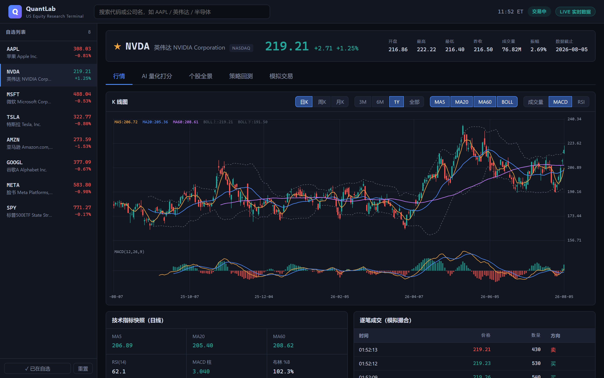
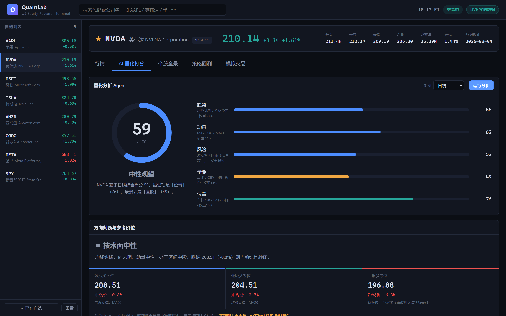
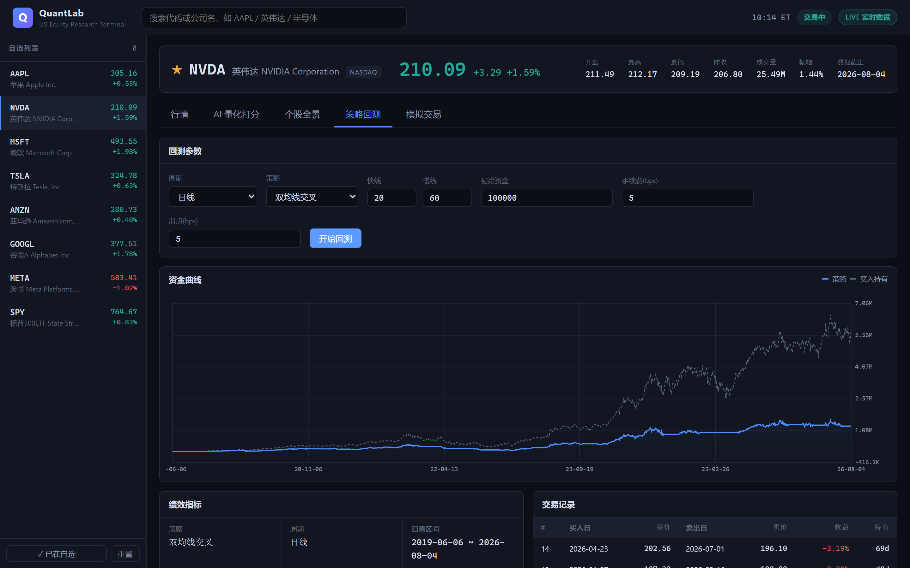
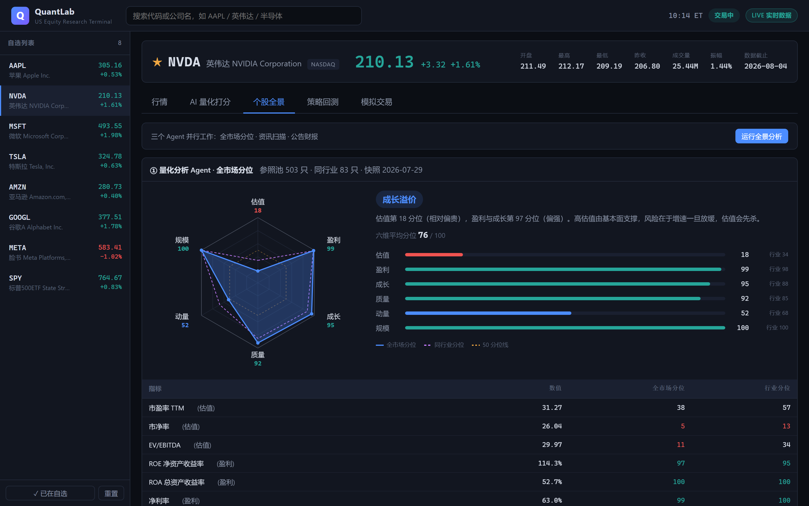
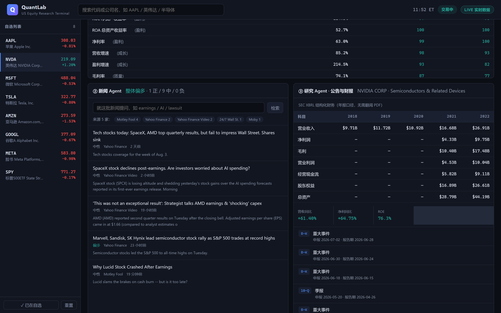
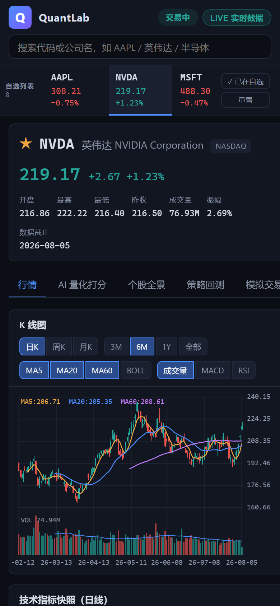

# QuantLab · 美股量化研究终端

[English](README.md) | **简体中文**

一个零依赖的纯前端量化研究工作台：行情看盘、策略回测、模拟交易，外加一个可解释的量化打分 Agent。
数据层做了适配抽象，既能用内置的行情模拟引擎离线跑，也能切到后端接真实美股数据。

[](https://github.com/Alexsheng26/quant-lab/actions/workflows/ci.yml)
[](https://github.com/Alexsheng26/quant-lab/actions/workflows/pages.yml)
[](LICENSE)


**🔗 在线 Demo：<https://alexsheng26.github.io/quant-lab/>**
（浏览器直接打开，跑内置模拟引擎；想看真实行情见下方「托管与部署」）

> ⚠️ 本项目仅用于学习与研究，所有输出不构成任何投资建议。

## 界面

**行情** —— 手写 Canvas K 线，均线 / BOLL / 斐波那契回撤 / 成交量 / MACD / RSI 副图，日K·周K·月K 切换



<table>
<tr>
<td width="50%"><b>AI 量化打分</b><br>五因子 0–100 评分、方向判断与三档技术参考位</td>
<td width="50%"><b>策略回测</b><br>资金曲线对比基准，18 项绩效指标与逐笔交易</td>
</tr>
<tr>
<td></td>
<td></td>
</tr>
</table>

**个股全景** —— 三个 Agent 协同：全市场分位（六边形雷达）、资讯扫描、SEC 公告财报





<table>
<tr>
<td width="42%"><b>移动端</b><br>窄屏下自选变成顶部横滑条，把宽度还给图表</td>
<td width="58%"></td>
</tr>
</table>

> 截图由 `backend/build_screenshots.py`（Playwright）生成，UI 改动后一条命令即可重出，
> 避免 README 里挂着几个版本前的界面。

## 功能

| 模块 | 说明 |
| --- | --- |
| **搜索** | 11700+ 个美股代码，支持代码 / 英文名 / 中文名，可按交易所（纳斯达克 / 纽交所 / ETF）筛选 |
| **自选** | 搜索结果一键加入，星标切换，悬停移出，状态存 localStorage |
| **行情** | 手写 Canvas K 线，**日K / 周K / 月K** 切换，均线 / BOLL / **斐波那契回撤** / 成交量 / MACD / RSI 副图 / 十字光标，指标快照，逐笔成交流 |
| **AI 量化打分** | 五因子 0–100 打分，**方向判断 + 三档技术参考位**，可选日线 / 周线 / 月线，每条结论附具体数值依据，权重可配置 |
| **个股全景** | 三个 Agent 协同：全市场分位（六边形雷达）· 资讯扫描与检索问答 · SEC 公告财报 |
| **策略回测** | 事件驱动引擎，6 种内置策略，**可选日线 / 周线 / 月线**，含手续费与滑点，输出资金曲线与 18 项绩效指标 |
| **模拟交易** | 虚拟 $100,000 账户，买卖撮合、持仓盈亏、成交流水，状态存 localStorage |

## 快速开始

### 只想看看 → 打开在线 Demo

<https://alexsheng26.github.io/quant-lab/> —— 不用装任何东西。
跑的是内置行情模拟引擎，**K 线图上有「模拟数据 · 非真实行情」水印**。

> 模拟模式的价格是按代码名哈希生成的，和现实无关——比如 TSM 可能显示 $23
> 而实际是 $399。日期轴是真实交易日，只有价格是合成的。

### 想要真实行情 → 起后端

克隆仓库后装一次依赖：

```bash
python -m venv .venv
.venv\Scripts\pip install -r backend/requirements.txt
```

之后 **Windows 双击 `quantlab.bat`** 就行——它会起后端、等就绪、再开网页。
右上角徽章变成绿色 `LIVE 实时数据` 就是接上了。

非 Windows，或想看后端日志：

```bash
.venv/bin/python backend/app.py     # 起后端，监听 127.0.0.1:8000
```

然后用浏览器打开 `index.html`，或直接用[在线 Demo](https://alexsheng26.github.io/quant-lab/)
——页面启动时会自动探测本机 8000 端口，探到就用真实数据。
（浏览器把 `localhost` 当可信来源，所以 HTTPS 页面也能连本机 HTTP 后端。Safari 除外。）

### 文件对照

| 文件 | 什么时候用 |
| --- | --- |
| `quantlab.bat` | **日常用这个**：起后端 + 开网页（Windows） |
| `index.html` | 只开网页；后端没起就是模拟数据 |
| `run-backend.bat` | 只起后端且保留窗口，排查报错时用 |
| `serve.bat` | 一般用不到。用 HTTP 伺服前端（`localhost:5500`），只有极少数场景需要绕开 `file://` |

> `.bat` 文件全部保持纯 ASCII。cmd.exe 是按字节偏移读批处理的，
> 文件里混 UTF-8 中文（尤其再加一句 `chcp`）会让解析器错位，脚本以匪夷所思的方式崩掉。
> 同理循环里用 `ping -n` 而不是 `timeout`——stdin 不是真实控制台时 `timeout` 会直接报错退出。

## 接入真实行情

前端默认跑在 **MOCK** 模式（内置行情引擎）。接真实数据：

```bash
python -m venv .venv
.venv\Scripts\pip install -r backend/requirements.txt
.venv\Scripts\python backend/app.py
```

Windows 下也可以直接双击 `run-backend.bat`。后端起在 `http://127.0.0.1:8000`，
然后点网页右上角的 `MOCK 模拟数据` 徽章切到 `LIVE`。

数据源切换会记在 localStorage。如果下次打开页面时后端没起，前端会先探活 `/api/health`，
失败就自动回落到 MOCK 并提示原因，不会变成一个拿不到数据的空页面。

### 接口

| 路径 | 说明 |
| --- | --- |
| `GET /api/health` | 健康检查，前端用它探活 |
| `GET /api/search?q=` | 标的搜索 |
| `GET /api/history?symbol=&days=` | 日线历史 |
| `GET /api/quote?symbol=` | 最新报价 |
| `GET /api/quant?symbol=` | 全市场 / 同行业分位与结构判断 |
| `GET /api/quant/universe` | 基本面快照元信息（只数、构建时间） |
| `GET /api/news?symbol=` | 新闻、逐条情绪与来源分布 |
| `GET /api/news/ask?symbol=&q=` | 新闻问答（检索式；配了 LLM 则为生成式 RAG） |
| `GET /api/filings?symbol=` | SEC 申报列表 |
| `GET /api/financials?symbol=` | XBRL 年度财务序列与派生指标 |
| `GET /api/filings/risk-changes?symbol=` | 10-K 风险因素逐年变化 |
| `GET /api/panorama/brief?symbol=` | 三 Agent 综合简报 |
| `GET /api/llm/status` | 当前用的是哪家 LLM（绝不回传 Key） |

### 全量代码表

搜索覆盖 **11700+ 个美股代码**（NASDAQ / NYSE / NYSE American / NYSE Arca / BATS / IEX），
数据来自 NASDAQ Trader 官方每日清单，免费无需 Key。刷新代码表：

```bash
.venv\Scripts\python backend/build_symbols.py
```

生成两份产物（都已入库，克隆下来直接能用）：

| 文件 | 给谁用 | 说明 |
| --- | --- | --- |
| `assets/data/symbols.js` | 前端 | 故意做成 `.js` 而不是 `.json`——`file://` 下 `fetch()` 读本地 json 会被 CORS 拦掉，用 `<script>` 加载则不受限制，双击 `index.html` 也能搜 |
| `backend/data/symbols.json` | 后端 | `/api/search` 用 |

搜索是纯前端的，输入即出结果，不打后端。排序按匹配质量：代码完全相同 > 代码前缀 >
名称词首 > 包含；常见标的加权，杠杆/反向 ETF 和 SPAC 壳降权（否则搜 `brk` 会被一堆
`BRKC`、`BRKU` 挤掉伯克希尔）。另有别名表，输 `tsmc` 会命中 `TSM`。

约 110 个常见标的带中文名，可以直接搜「英伟达」「阿里」「半导体」。
脚本会先尝试用 akshare 拉全量中文名，失败则回落到内置映射表。

交易所归类按官方 Exchange 码，不做主观调整。容易被误认为错误的几个：
**台积电 TSM、阿里 BABA、蔚来 NIO、Visa、摩根大通都在 NYSE**（ADR 多在纽交所挂牌），
阿斯麦 ASML 才在纳斯达克。想只看纳斯达克就用搜索框里的筛选按钮。

> **构建这份表时踩的坑**（都已修）：
> - 用 `depositary shares` 当噪音关键字过滤，会把**所有 ADR 删光**——中概股、台积电全没了
> - 用子串匹配过滤 `right`，会误杀 **B-right** Horizons 这类正常公司，必须用词边界
> - 类别股在官方清单里写作 `BRK.B`，yfinance 要的是 `BRK-B`，得转换而不是丢弃

### 关于数据源

| 数据源 | 美股支持 | 说明 |
| --- | --- | --- |
| **yfinance** | ✅ 完整 | 后端默认源，覆盖最全、字段最稳，可拿到盘中价 |
| **akshare** | ⚠️ 可用 | 走东财 `stock_us_daily`，只有日线、通常延迟 15 分钟以上，作为兜底源 |
| **SEC EDGAR** | ✅ 完整 | 公告与 XBRL 结构化财务，官方免费无需 Key |
| **baostock** | ❌ 无 | **只有 A 股**，没有美股数据，因此没有接入 |

浏览器不能直接 `import akshare` —— 它们是 Python 库，必须由后端调用。这也是 `backend/` 存在的原因。
要接付费实时源（Polygon / Alpaca / Finnhub / IEX），只需在 `backend/app.py` 的 `HISTORY_PROVIDERS`
里加一个函数，前端一行都不用改。

> **踩过的坑**：yfinance 1.x 把 `fast_info` 的键从 `last_price` 改成了 `lastPrice`。
> 后端两种命名都试，避免升级一次就静默退回日线数据。

> **开发提示**：改完 JS/CSS 记得 `Ctrl+F5` 硬刷新。本地静态服务不发 `Cache-Control`，
> 浏览器会启发式缓存旧脚本，很容易对着旧代码调试。

## 托管与部署

**前端是纯静态的，后端是 Python —— GitHub Pages 只能托管前者。** 这决定了部署形态：

| 部分 | 托管在哪 | 效果 |
| --- | --- | --- |
| 前端（`index.html` + `assets/`） | GitHub Pages，推送自动发布 | 任何设备打开即用，跑内置模拟引擎 |
| 后端（`backend/`） | 访问者自己本机运行 | 想要真实行情就克隆仓库跑一下后端 |

在线 Demo 默认是**模拟数据**（K 线图上有水印，不会认错）。点右上角徽章切 LIVE 时，
页面会问后端地址——本机跑了后端就填 `http://127.0.0.1:8000`。

> **混合内容策略**：HTTPS 页面请求 `http://` 接口通常会被浏览器拦截，
> 但 `localhost` / `127.0.0.1` 是例外——Chrome 和 Firefox 视其为可信来源放行，
> **Safari 不放行**。Safari 用户需要本地起个 HTTPS 后端，或直接克隆仓库本地打开。

### 发布到 GitHub Pages

`.github/workflows/pages.yml` 已配好，推送到 `main` 自动发布。首次需要在
仓库 **Settings → Pages → Source** 选 **GitHub Actions**（不是 Deploy from a branch）。

工作流只挑出 `index.html` 和 `assets/` 发布，并加 `.nojekyll`
（否则 Jekyll 会忽略下划线开头的文件）。

### 可选：把后端也部署上去

`render.yaml` 是 Render 免费档的蓝图。部署前先掂量三件事：

1. **免费档 15 分钟无请求就休眠**，冷启动 30~60 秒。
2. **数据中心 IP 常被 Yahoo 限流**，yfinance 会间歇性失败——本地跑没这问题。
3. **API Key 放上去 = 谁都能花你的钱**。已内置每 IP 每小时 30 次的生成式问答限流
   （`LLM_CALLS_PER_HOUR` 可调，超额降级为检索式而不是报错），但 IP 可以换，
   这只挡得住无意的循环和顺手的滥用。

部署时**必须**设 `ALLOWED_ORIGINS`，否则 CORS 默认放开，任何网页都能调你的后端：

```
ALLOWED_ORIGINS=https://<你的用户名>.github.io
```

## 项目结构

```
quant-lab/
├── index.html                 # 单页应用外壳
├── quantlab.bat               # Windows 一键启动：后端 + 网页
├── serve.bat                  # 起前端静态服务（localhost:5500）
├── run-backend.bat            # 起行情后端（127.0.0.1:8000）
├── assets/
│   ├── css/style.css          # 深色交易终端主题
│   ├── data/symbols.js        # 全量美股代码表（自动生成，勿手改）
│   └── js/
│       ├── config.js          # 全局配置（数据源、打分权重、初始资金）
│       ├── utils.js           # DOM / 格式化 / 存储 / 事件总线
│       ├── indicators.js      # SMA EMA RSI MACD BOLL ATR ROC 唐奇安 斐波那契 + 绩效统计
│       ├── dataSource.js      # 数据适配层：MockProvider / LiveProvider
│       ├── chart.js           # Canvas 绘图：CandleChart / LineChart / RadarChart
│       ├── market.js          # 行情视图
│       ├── agent.js           # 量化打分 Agent
│       ├── agents.js          # 个股全景：三个 Agent + 综合简报的编排
│       ├── backtest.js        # 回测引擎 + 回测视图
│       ├── paper.js           # 模拟交易
│       └── app.js             # 状态编排、路由、行情轮询
└── backend/
    ├── app.py                       # FastAPI 服务与路由
    ├── news.py                      # 新闻 Agent：抓取 / 情绪 / 检索问答
    ├── llm.py                       # 多 provider LLM 层（DeepSeek / Claude，可选）
    ├── research.py                  # 研究 Agent：SEC 申报 + XBRL 财务
    ├── filing_text.py               # 10-K 正文抽取与逐年比对
    ├── fundamentals.py              # 量化 Agent：横截面分位与结构判断
    ├── build_symbols.py             # 生成全量代码表
    ├── build_universe_snapshot.py   # 生成基本面快照（分位数的参照池）
    ├── build_screenshots.py         # 重新生成 README 截图
    ├── audit_a11y.py                # 无障碍审计：axe-core + 悬停态
    ├── audit_keyboard.py            # 纯键盘走查
    ├── data/symbols.json            # 代码表（自动生成）
    ├── data/universe_snapshot.json  # 基本面快照（自动生成）
    └── requirements.txt
tests/                               # pytest；tests/js/ 在 Chromium 里跑前端测试
```

## 设计要点

**数据适配层。** 上层只认三个方法 `search` / `getHistory` / `getQuote`，
换数据源不影响任何业务代码。

**模拟数据不是随机数。** MockProvider 用的是单因子模型：

```
个股收益 = drift + beta × 市场冲击 + 特质冲击
```

市场因子带波动率聚集（平静期与恐慌期交替）与偶发系统性回调，个股再叠加自己的
波动率聚集和财报跳空。所以自选列表里的标的会一起涨跌，Beta 和相关性都是真实存在的。
同一个代码用同一个种子，刷新页面历史不变。

**回测不偷看未来。** `signals[i]` 表示第 i 根收盘后想持有的仓位，成交发生在第 i+1 根的
开盘价，并扣手续费与滑点。策略函数拿不到 i 之后的任何数据。

**周期由日线聚合。** 周K / 月K 不额外请求数据，用日线重采样：
开=段内首根开盘、高=段内最高、低=段内最低、收=段内末根收盘、量=累加，
标签取段起始交易日，未走完的当期照样输出（即"本周至今"）。

K 线、指标快照、回测、AI 打分四处都能选周期，且**年化换算因子跟着周期变**
（252 / 52 / 12）。漏了这一步，周线的年化波动率会被高估约 √5 倍——
这是加周期选项时最容易踩的坑。

**斐波那契回撤的方向不能猜。** 工具栏 `FIB` 会在当前可视区间的最高价与最低价
之间画出 23.6% / 38.2% / 50% / 61.8% / 78.6% 五档，并给 38.2%~61.8% 这段
（交易员最常盯的回撤区）铺一层底色。

关键在于 **0% 画在哪一头由摆动方向决定**，而方向取决于两个端点谁出现得更晚：

| 形态 | 判定 | 0% | 100% | 中间各档的含义 |
| --- | --- | --- | --- | --- |
| 上升段 | 低点在前 | 最高价 | 最低价 | 回调支撑位 |
| 下降段 | 高点在前 | 最低价 | 最高价 | 反弹阻力位 |

方向搞反的话，38.2% 和 61.8% 会整个镜像——线还在、数字还对，但结论完全相反，
是这类实现最常见的错误。`tests/js/suite.js` 里专门有一条用例：同一组价格、
只交换出现顺序，回撤位必须不同。

比例本身来自斐波那契数列相邻项的比值：数列越往后前项除后项收敛到 0.618
（黄金分割），隔一项 0.382，隔两项 0.236，0.786 是 0.618 的平方根。
0.5 严格说不属于这一族（来自道氏理论的"腰部"），但所有交易软件都画，这里跟随惯例。

> 回撤位是**历史高低点的算术推论**，不是预测。它的价值在于把"市场在哪些价位
> 可能有反应"变成几个具体数字，方便事后验证，而不是告诉你接下来会涨会跌。

默认拉 1800 根日线（约 7 年，见 `config.js` 的 `historyDays`）。
这个数字不是随便定的：月线由日线聚合，1800 根日线才有 ~87 根月线，
刚够算 MA60；早先取 760 根（3 年）时只有 37 根月线，月线分析直接跑不起来。

样本不足时回测和打分会**明确拒绝执行并说明缺多少根**，而不是返回一堆
基于 null 的假绩效。注意即便能跑，月线三年只出 1~2 笔交易，
统计上没有意义——周期越长越要看交易次数。

**异步结果要认领。** LIVE 模式下一次取数要 0.5~2 秒，而行情轮询间隔是 2 秒。
用户连点两个标的时，先发的请求可能后到，把旧标的的价格写到新标的头上。
所以 `setSymbol` 带请求序号、轮询回调比对 `QL.state.symbol`，序号或标的不匹配就丢弃结果。

**自动决策不要写进用户偏好。** 数据源只在用户点击徽章时才写 localStorage，
自动探测和自动回落都不写。早先版本不区分二者——后端没起时的临时回落把 `"mock"`
存了进去，此后即使后端跑着也判定"用户选了模拟数据"，永久卡在假价格上，
表现就是"所有股票价格都对不上现实"。存储格式改成带 `explicit` 标记的对象，
旧的裸字符串一律当作"没选过"，让老用户自动恢复。

**打分不是黑箱。** 五个因子各自算成 0–100 再加权，每条结论都附上算出它的具体数值
（`config.js` 里可以直接调权重）：

| 因子 | 权重 | 观察的东西 |
| --- | --- | --- |
| 趋势 | 30% | 价格相对 MA20/MA60 位置、均线排列、MA20 斜率 |
| 动量 | 22% | RSI(14)、ROC20/60、MACD 柱 |
| 风险 | 16% | ATR%、年化波动率、60 日最大回撤（越低分越高） |
| 量能 | 14% | 5/20 日量比、OBV 斜率，且要求与价格方向一致 |
| 位置 | 18% | 布林 %B、52 周区间分位（过热会扣分） |

**技术参考位是描述，不是预测。** 打分面板给出三档价位：

| 档位 | 取法 |
| --- | --- |
| 试探买入位 | 现价下方最近的一档支撑（MA20 / MA60 / 布林下轨 / 区间低点，取最接近的） |
| 低吸参考位 | 再往下一档支撑；若没有，则试探位 − 1.2×ATR |
| 止损参考位 | 低吸位 − 1×ATR，跌破即视为支撑判断失效 |

每档都标出依据和距现价百分比。方向判断也刻意写成「当前结构 + 什么条件下转向」
（例如"跌破 319.89 则结构转弱"）而不是"接下来会涨"——技术指标是历史价格的函数，
没有预测能力，给可证伪的条件才能被验证。

**关键的边界情况**：股票创新低时，下方所有均线和区间低点都在头顶，
算出来的"支撑"其实是拿波动率外推的，这时候展示买入位等于诱导接飞刀。
所以现价处于近 60 根新低、或下方支撑不足 2 档时，面板会打出橙色警告说明这一点。

## 三个 Agent

「个股全景」页把三个 Agent 放在一起——查一只票时想看的是全方位信息，不该来回切页面。

### ① 量化分析 Agent · 全市场分位

回答"PE 在全市场排第几、ROE 打败了多少同行"。做法是**横截面分位**：
先离线跑 `build_universe_snapshot.py` 拉 503 只标普 500 成分股的基本面存成快照（约 27 秒），
再把目标股的每个指标放回池子里排名，同时给出同行业分位。

六个维度画成雷达图：估值（PE/PB/EV-EBITDA，反向）· 盈利（ROE/ROA/净利率）·
成长（营收/盈利增速）· 质量（毛利率/流动比/负债率反向）· 动量（52周涨幅/距高点）· 规模（市值对数）。

结构判断给出「沧海遗珠 / 价值陷阱 / 成长溢价 / 估值缺乏支撑」等标签。两个容易做错的地方：

- **不能只写"便宜×好"四个分支。** 一边极端、另一边中等时会掉进兜底分支，
  而兜底文案说"两边都没有明显偏离"——估值第 9 分位被说成没有偏离，是错误结论。现在是 3×3 九宫格。
- **盈利和成长不能直接平均。** NIO 盈利第 1 分位、成长第 99 分位，平均成 50「中等」，
  把最关键的信息抹平了。两者相差 40 分位以上时单独判定为「增长未兑现盈利」或「高盈利低增长」。
- **维度不足不给总分。** ETF 只有 2/6 个维度有数据，硬算平均分会让人以为是完整评分。

### ② 新闻 Agent · 资讯扫描

抓 Yahoo Finance 新闻，用金融语境情绪词典逐条打分并聚合。
**关于信息茧房**：单一来源本身就是茧房，所以把每条的媒体来源标出来并统计分布，
某一家占比超过 60% 就直接提示口径单一。

问答是两级的，**界面上永远标明当前用的是哪一级**：

| 模式 | 何时生效 | 输出 |
| --- | --- | --- |
| 检索式（默认） | 没配 API Key | TF-IDF 排序的原文片段 + 出处，橙色徽章「检索式 · 非生成式」 |
| 生成式 RAG | 配了 `DEEPSEEK_API_KEY` 或 `ANTHROPIC_API_KEY` | 综合多篇报道，带 `[n]` 出处标注、置信度和局限性说明，紫色徽章标出模型名 |

没有 LLM 时绝不编一段通顺的话冒充"AI 总结"——那会让人误以为是模型的结论。

**接入方式**见下文「LLM 用在哪里」一节：复制 `.env.example` 为 `.env`，
填 `DEEPSEEK_API_KEY` 或 `ANTHROPIC_API_KEY`，重启后端即可。

实现细节：

- **检索层不变。** LLM 只看排序后的 top-K 片段，不接触整个语料库——省 token，也让引用可追溯。
- **提示注入防护。** 新闻正文是不可信输入，标题里可能藏「忽略以上指令」之类的内容。
  文章被包在 `<articles>` XML 标签里和系统指令物理隔开，并明确声明其为数据而非指令。
- **结构化输出。** 约束成 JSON（answer / cited / confidence / caveat），不靠解析自由文本，
  引用编号能可靠地映射回原文并在界面上高亮。Claude 由模型端按 schema 强制；
  DeepSeek 只保证合法 JSON，所以后端自己再校验一遍字段。
- **全链路降级。** 没装包、没配 Key、Key 无效、模型拒答、返回非法 JSON——
  任何一种都退回检索式并说明原因，不会 500，也不会假装有 AI。已逐条验证。
- 用 Claude 时设 `effort: "medium"` —— 新闻综合不需要更深的推理，这个档位性价比最好。

### ③ 研究 Agent · 公告与财报

数据来自 **SEC EDGAR 官方接口**，免费无需 Key。关键点是**不去解析 PDF**——
SEC 强制上市公司用 XBRL 提交结构化财务，`companyfacts` 接口直接返回机读的
营收/净利/毛利/现金流/权益等科目，比从几百页 10-K 抽文本可靠得多。

同一科目在不同年份可能用不同的 us-gaap 标签（`Revenues` vs
`RevenueFromContractWithCustomerExcludingAssessedTax`），代码按优先级依次尝试并做重述去重。
申报列表把 10-K/10-Q/8-K 这类主要文件和 Form 4（高管交易，数量最多但信息量低）分开。

ETF 和部分 ADR 不在 SEC 登记名录里，这时明确说明原因而不是留空白。

## 内置策略

| 策略 | 逻辑 |
| --- | --- |
| 双均线交叉 | 快线上穿慢线做多，下穿平仓 |
| RSI 均值回归 | RSI 低于阈值买入，高于阈值卖出 |
| MACD | 柱由负转正做多 |
| 布林带突破 | 上轨突破做多，跌破中轨平仓 |
| 唐奇安通道 | N 日新高做多，M 日新低平仓（海龟式） |
| 买入持有 | 基准 |

绩效指标：总收益、年化收益（CAGR）、最大回撤、夏普比率、卡玛比率、年化波动、
胜率、盈亏比、平均持有天数、仓位暴露、手续费合计、相对基准超额收益。

## LLM 用在哪里（以及刻意不用在哪里）

项目的设计原则是一句话：**数字由确定性代码算，文字由 LLM 读。**

打分、分位排名、回测绩效、斐波那契回撤全是可复算的纯函数，同样输入永远
同样输出，每一步都能复查。模型只做三件语言上的事，而且 prompt 里明确
禁止它产生新数字、禁止给投资建议。

| 用途 | 做什么 | 不做什么 |
| --- | --- | --- |
| 新闻 RAG 问答 | 基于检索到的片段回答，带 `[n]` 出处 | 不补充模型自己的知识 |
| 10-K 风险因素逐年变化 | 解读本地比对出来的新增/删除段落 | 不读全文、不自己做比对 |
| 三 Agent 综合简报 | 把已算好的结论串成一段话、指出三方矛盾 | 不做算术、不产生新数字 |

### 接哪个模型

两个 provider，都不是必需的——一个都不配时相关功能降级成检索式 / 纯文本比对，
不报错也不假装有 AI。

| | 用途 | 说明 |
| --- | --- | --- |
| **DeepSeek** | 默认首选 | 国内直连，便宜一到两个数量级。读 10-K 正文这种长文本，成本差距直接决定功能开不开得起 |
| **Claude** | 备选 | 结构化输出是模型端强制的，更可靠 |

```bash
cp .env.example .env     # 然后填 DEEPSEEK_API_KEY 或 ANTHROPIC_API_KEY
```

两个都配时默认用 DeepSeek，`LLM_PROVIDER=claude` 可强制切换。模型名和
base_url 都能用环境变量覆盖，厂商改命名时不用动代码。

> ⚠️ **API Key 绝不要贴进聊天记录、issue、截图或任何公开场合。**
> 泄露过的 Key 立刻去控制台作废重建——GitHub 上的 Key 通常几分钟内
> 就会被爬虫扫到。`.env` 已在 `.gitignore` 里。

两家的结构化输出能力不一样，这是接多 provider 最容易踩的坑：Anthropic 的
`json_schema` 由模型端强制，DeepSeek 走 OpenAI 兼容的 `response_format`
只保证"是合法 JSON"、不保证字段齐全。所以抽象层里统一自己验一道，
字段缺失就当失败降级——不能让半个对象流到前端。

## 风险因素逐年变化

研究 Agent 原本只做了一半：列申报清单、拉 XBRL 数字。但"不用自己翻几百页 PDF"
缺的恰恰是**正文**那一半。

10-K 的 Item 1A 风险因素每年重写，新增一条往往意味着管理层真的开始担心某件事，
常常比财务数字更早反映问题。专业分析师确实在做这个对比，因为两份各几十页的
法律文本人工对照一遍要两小时。

**机械比对在本地做完，模型只负责解读。** 这既省掉 90% 以上的 token，
又保证每一条结论都能对回原文——界面上每条新增风险都附带英文原文摘录。

实测苹果 FY2025 抓出来的新增风险包括：美国关税与 Section 232 半导体调查、
Google 反垄断救济对搜索分发收入的威胁、AI 训练数据的版权风险。

### 比对算法踩过的坑

第一版用 difflib 逐段模糊匹配，合成用例上很漂亮，真实年报一跑就崩——
苹果 2024→2025 报出 **40% 的段落是"新增"**，里面全是"海外销售占多数"
"制造外包在中国大陆"这种每年必写的内容。

原因是公司每年会重新切分段落：去年拆成两段的今年合成一段。逐段配对时
一段对半段，相似度最高也就 0.5，**调阈值救不回来**（0.75 降到 0.5，
误报只从 38 段降到 29 段）。

改成 **n-gram 覆盖率**：拿每个段落去对照年份的整篇正文里找覆盖，
合并拆分就不再有影响。

| | 逐段配对 | n-gram 覆盖率 |
| --- | --- | --- |
| 「制造外包…」段落得分 | 0.15（误判新增） | **0.84**（正确识别） |
| 苹果新增占比 | 40% | **9.5%** |

### 什么时候不该相信它

先说已处理的排版差异：微软正文标题只写 `Item 1A`（不跟 "Risk Factors"）、
20-F 用 `Item 3.D` 而不是 `Item 1A`（中概 ADR 全走这条）、
摩根大通申报量太大需要翻页取历史年报。

处理完这些，实测 8 家公司的结果（新年报里被判为新增的段落占比）：

| 公司 | 新增占比 | 判定 |
| --- | --- | --- |
| KO / NIO / AAPL / NVDA / TSLA / MSFT | 1.1% ~ 19.6% | 正常 |
| JPM | 43.8% | 不可信：公司大幅改写了措辞 |
| BABA | 97.2% | 不可信：章节没有定位准 |

这两家不可信的原因不一样，值得分开说：

- **BABA 是程序的问题。** 20-F 的排版和 10-K 差得多，抽出来的章节两年对不上。
- **JPM 不是程序出错，而是方法本身的边界。** 它把"声誉风险"这类老内容改写成了
  "引导句 + 项目符号"的结构，文字全是新的，概念却是旧的。n-gram 覆盖率衡量的是
  **文字**新旧，不是**概念**新旧——公司改写得越狠，"新增"就越不可信。

所以加了可信度自检：**新增占比超过 30% 就标记为不可信、说明可能的原因、
并跳过模型调用**。阈值落在正常公司最高值（19.6%）和 JPM（43.8%）之间，
留了约 10 个点余量。

阈值最初设的是 60%，只拦得住 BABA。JPM 这种半真半假的结果会被当成正常结论
端给用户，还会附上一段看起来很像回事的模型解读——那比直接说"不确定"更糟。
拿不可靠的输入去生成解读，结论越通顺越误导。

## 三 Agent 综合简报

全景页顶部，把下面三个 Agent 已经算好的结论织成一段话。

最有价值的输出是 **conflicts**——三个 Agent 互相矛盾的地方，比如分位显示
便宜但新闻全是负面、盈利分位很高但质量分位中等。单看任何一个 Agent 都
发现不了这些。

两个刻意的设计：

- **不传数据上行。** 后端自己从三个 Agent 的缓存里取结论。如果让前端把
  结论 POST 上去，等于谁都能往 prompt 里塞任意文本。
- **只喂结论，不喂原始数据。** 模型看到的是"估值第 12 分位""净利率 26.9%"
  这种算好的数字，不是 K 线和逐笔成交。它的职责是串联和复述，不是分析。

## 测试

195 个测试，5 秒跑完，不联网。

```bash
pip install -r requirements-dev.txt
python -m playwright install chromium
python -m pytest
```

只跑后端逻辑（不需要浏览器，1.5 秒）：

```bash
python -m pytest -m "not js and not a11y"
```

| 文件 | 覆盖 |
| --- | --- |
| `tests/test_research.py` | SEC XBRL 年报识别、重述去重、CIK 类别股回退 |
| `tests/test_fundamentals.py` | 分位排名、3×3 判定表九格、盈利/成长背离、总分门槛 |
| `tests/test_search.py` | 排序优先级、杠杆产品降权的词边界、别名表、响应投影 |
| `tests/test_llm.py` | provider 选择、Key 脱敏、两家各自的降级路径、提示注入隔离、prompt 约束 |
| `tests/test_filing_text.py` | 10-K 正文抽取、段落合并拆分的 diff、可信度守卫 |
| `tests/test_api.py` | 路由与响应模型校验、限流、CORS |
| `tests/test_js.py` + `tests/js/` | 前端纯函数：指标、斐波那契回撤、回测引擎、绩效统计 |

**前端测试为什么在浏览器里跑**：项目是零依赖的经典 `<script>` 结构，没有
package.json 也没有模块系统。与其为了测试引入整套 npm 工具链，不如直接用
Playwright（无障碍审计已经在用）加载 `assets/js/` 里的**真实源文件**，
在 Chromium 里跑断言——那本来就是这些代码的运行环境。本地和 CI 都只需要
Python 一套工具链。

测试全程 mock 掉数据源，`conftest.py` 会拦截任何连非回环地址的请求，
所以 SEC / Yahoo 抖动不会让 CI 随机变红。

写这批测试时抓到三个真实 bug，都已修复：

- `llm.py` 把上游异常消息原样回传给前端。SDK 的认证错误里可能带着 API Key，
  等于把密钥打印到浏览器上。现在所有出栈的错误文本都过一遍 `_scrub()`。
- `indicators.js` 的夏普比率在收益率近乎恒定时失控。`vol === 0` 拦不住浮点误差
  留下的 ~1e-19，除下去得到 2×10¹⁶ 这种数字直接显示给用户。
- 回测引擎把未平仓持仓也记为一条 trade（`open: true`）——行为是对的，
  但没有测试钉住，很容易在重构时被改坏。

## 无障碍

目标 WCAG 2.1 AA。两个脚本可复现，不是"加几个 aria 属性就算数"：

```bash
python -m http.server 5710          # 另开一个窗口
.venv\Scripts\python backend\audit_a11y.py       # axe-core，逐个标签页
.venv\Scripts\python backend\audit_keyboard.py   # 纯键盘走查，24 项断言
```

当前结果：**axe-core 0 违规，键盘走查 24/24 通过**。首次审计的基线是 2 类问题共 195 处。

做了什么：

| 项 | 说明 |
| --- | --- |
| 对比度 | `--text-faint` 从 `#5a6479`（2.73:1）提到 `#828da3`；实心按钮改用深色字压在品牌色上（6.0～6.4:1），而不是压暗品牌色——涨绿跌红在图表里到处都是，不能为按钮改掉 |
| 键盘导航 | 标签页用 WAI-ARIA 惯例：组内单一 tabindex，左右/Home/End 切换；搜索框下键进结果列表、上下移动、Enter 选中、Esc 关闭 |
| 跳转链接 | 首个 Tab 位，跳过顶栏和自选列表直达 `#main` |
| 焦点可见 | `:focus-visible`，只在键盘操作时画焦点环 |
| 图表替代文本 | 三张 Canvas（K 线、资金曲线、六边形雷达）都带动态 `aria-label`，把图里的数字用一句话讲出来 |
| 屏幕阅读器 | tablist/tabpanel、combobox/listbox、`aria-pressed`、toast 用 `role="status"`；滚动区域可聚焦 |
| 减少动效 | 尊重 `prefers-reduced-motion` |

两个脚本各自能抓到不同的东西：axe 只看静止状态的标记，抓不到"Tab 走不到"或"悬停时主按钮变回灰底"（后者对比度反而有 10.9:1，纯粹是视觉回归），所以悬停态断言单独写在 `audit_a11y.py` 里。

## 后续计划

- [ ] 分钟级 / 盘中数据
- [ ] 参数网格搜索与热力图
- [ ] 多标的组合回测与相关性矩阵
- [ ] 止损 / 止盈 / 仓位管理（凯利、固定风险）
- [ ] 打分 Agent 接入基本面因子（PE、营收增速、毛利率）
- [x] 接入 LLM 生成自然语言研报（三 Agent 综合简报、10-K 风险因素解读）
- [ ] 概念级的风险因素比对（应对摩根大通那种大幅改写措辞的情况）
- [ ] 走样本外检验与过拟合检测（Walk-forward）

## License

MIT
